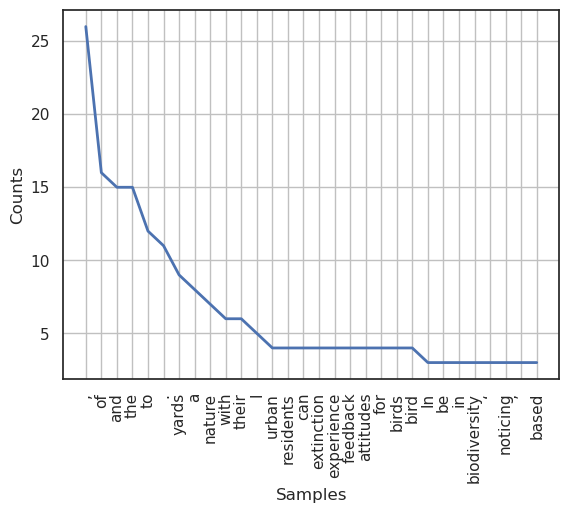

# Natural Language Processing

## [NLTK library](https://www.nltk.org/)
### Text Processing
    import nltk
`text.concordance("word")`
Finds the occurence of word and it's surrounding words (context)
    
`text.similar("word")`
Finds similar phrases to word in text

`text.common_contexts(["word","word"])`
Finds common words used nearby the two words
    
`text.dispersion_plot(["list", "of", "words"])`
finds how many times each word is used in a text. Follows the 
"power law."

### Frequency Distribution
Determine many times in the text each word is used visually.

    abs_freq = FreqDist(nltk_abstract)
    nltk_abstract = Text(wordtokens_abstract)
    abs_freq.plot(30)
    

### Tokenizing
>Tokens: could be words, sentences, punctuation symbols in a text

It's generally a good idea to make the text lowercase: 
`text_lower = text_variable.lower()`

`word_tokenize(text_variable)`
uses RegEx to split text string into individual words and symbols.

`sent_tokenize(text_variable)`
uses RegEx to split text string into individual sentences.

Use `len(token_list)` to see number of tokens,
or `len(set(token_list))` to see number of unique tokens

### Stopwords
    from nltk.corpus import stopwords
We want the text to be as simple and as easily interpretable as
possible, so we need to remove words that don't have meaning,
such as 'a'.

`stopwords = stopwords.words("english")` give you a list of
stopwords in English. *note lowercase 'english'*

You can then use list comprehension, or write a function to
make a new list of words from your next that does not include
stopwords.

`new_text = [word for word in text if word not in stopwords]`

### Lemmatize and Stem
`nltk.WordNetLemmatizer()`
NLTK function to lemmatize the words of the text, reducing the word
to its dictionary form without conjugations.
`nltk.SnowballStemmer()`
NLTK function to stem the words of the text, reducing the words to 
their stems by removing plurality.

### Sentiment Intensity Analysis
    from nltk.sentiment import SentimentIntensityAnalyzer
Sentiment intensity analysis (SIA) is used to understand the sentiment 
of a phrase (i.e., is the statement positive or negative?)

For SIA, follow the previous steps of tokenization, stopword removal, 
lemmitization and stemming.

`SentimentIntensityAnalyzer()` is the NLTK model to analyze sentiment.
The algorithm reads the text and breaks it down into percentages of
negative, neutral, and positive sentiment and also provides a
compound score.
>the compound score is a normalized measure of sentiment intensity.
> - compound score >= 0.05 is positive
> - 0.05 > compound score < -0.05 is neutral
> - compound score <= -0.05 is negative

# scikit learn topic modeling
topic modeling: find topic among texts
gives you phrases that show topic, have to define topics yourself
-- check out litcof library for text mining for lit reviews

## [NMF - Non-negative Matrix Factorization](https://scikit-learn.org/stable/modules/generated/sklearn.decomposition.NMF.html#sklearn.decomposition.NMF)
    from sklearn.decomposition import NMF
NMF is an unsupervised machine learning method for dimensionality 
reduction, like PCA, t-SNE. Its used in image analysis, text mining and 
recommendation systems. It's good for datasets with many ambiguous
features, but it has a low predictability power. 
### Methods
NMF will find two non-negative matrices (W,H) whose product approximates 
the original matrix.

Example:

NMF takes original matrix A and splits it into two matrices that
approximate the solution of matrix A. Values for matrices W and H
are initialized with random non-negative values and are then
modified to minimize the difference between A and W x H. The
model continues to iterate this step until it stabilizes.

### Usage
    from sklearn.feature_extraction.text import TfidVectorizer
Preprocessing can be accomplished with [TfidVectorizer (tf-idf)](https://www.geeksforgeeks.org/understanding-tf-idf-term-frequency-inverse-document-frequency/),
which automatically preprocesses the text as in
the steps listed above ranks the words in the text. Example:

    tfidf_vectorizer = TfidfVectorizer(max_df=0.95, min_df=2 
                                       stop_words='english')
    tfidf = tfidf_vectorizer.fit_transform(text)
    tfidf_feature_names = tfidf_vectorizer.get_feature_names_out()

Then, you can run NMF with
`NMF().fit(tfidf)`
Topics cannot be determined automatically. You must look through the data to determine the topics yourself.

## [LDA - Latent Dirichlet Allocation](https://scikit-learn.org/stable/modules/generated/sklearn.decomposition.LatentDirichletAllocation.html)
    from sklearn.decomposition import LatentDirichletAllocation

LDA is probabilistic Bayesion model for topic modeling. It generates topics, then classifies words among those topics according to
probability distributions.

### Methods

LDA assumes that documents are generated like this: 
topics are randomly distributed and are made up of words that have a 
probability of belonging to that topic based on frequency and 
co-occurrence.
LDA then attempts to reverse enginner this process. To assign topics to 
words, LDA employs Gibbs sampling, which is based on Markov Chain Monte 
Carlo techniques.

### Usage
    from sklearn.feature_extraction.text import CountVectorizer
Preprocessing for LDA cannot use TfidfVectorizer, so we will only use 
CountVectorizer, which is the first step of the TfidVectorizer and 
preprocesses the text by converting it to a matrix of token counts:

    tf_vectorizer = CountVectorizer(max_df=0.95, min_df=2,
                                    stop_words='english')
    tf = tf_vectorizer.fit_transform(documents)
    tf_feature_names = tf_vectorizer.get_feature_names_out()

And your model would look something like:

    lda = LatentDirichletAllocation(n_components=components,max_iter=5,
                                    learning_method='online', 
                                    learning_offset=50.,random_state=0)
                                    .fit(tf)